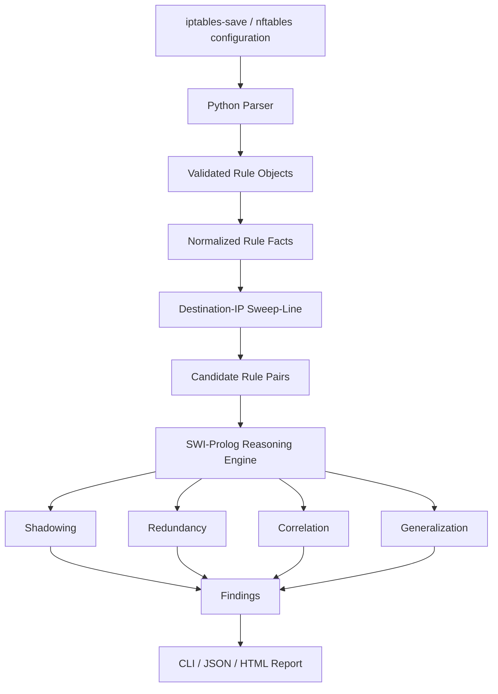
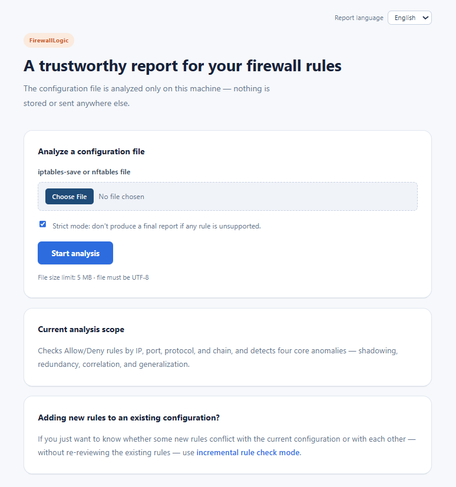

# FirewallLogic

### Automated Firewall Policy Auditing with Symbolic Reasoning & Sweep-Line Optimization

<p align="center">
  
  
  
  
  
  
</p>

---

## Table of Contents

- [Abstract](#abstract)
- [Research Motivation](#research-motivation)
- [Key Contributions](#key-contributions)
- [System Architecture](#system-architecture)
- [Sweep-Line Optimization](#sweep-line-optimization)
- [Symbolic Anomaly Detection](#symbolic-anomaly-detection)
- [Supported Analysis Features](#supported-analysis-features)
- [Repository Structure](#repository-structure)
- [Screenshots & Experimental Outputs](#screenshots--experimental-outputs)
- [Research Interests & Academic Alignment](#research-interests--academic-alignment)
- [Limitations](#limitations)
- [Future Research Directions](#future-research-directions)
- [Author](#author)

---

## Abstract

**FirewallLogic** is a hybrid Python–Prolog system for automatically auditing firewall policies and detecting four classes of rule anomalies:

- **Shadowing**
- **Redundancy**
- **Correlation**
- **Generalization**

The core research idea is to combine **symbolic reasoning** with an algorithmic candidate-generation layer. Instead of sending every possible rule pair to the logic engine, FirewallLogic first applies a **destination-IP sweep-line algorithm** to identify potentially overlapping rule pairs. The surviving candidates are then evaluated using symbolic predicates in Prolog.

This separation keeps the logical semantics explicit while reducing unnecessary pairwise reasoning.

---

## Research Motivation

Firewall policies are naturally represented as logical rules, making them a useful setting for studying **interpretable AI and logic-based reasoning**. However, naïve pairwise comparison becomes expensive as the policy grows.

This project investigates a simple research question:

> **Can algorithmic candidate filtering reduce the computational cost of symbolic firewall reasoning without changing the semantic detection rules?**

The optimization is therefore deliberately placed **before** the reasoning layer rather than replacing the reasoning itself.

---

## Key Contributions

| Area | Contribution |
|---|---|
| **Logic-Based AI** | Firewall rules represented and evaluated through explicit symbolic predicates in Prolog |
| **Interpretable AI** | Findings are derived from explicit rule relationships rather than opaque predictions |
| **Algorithm Design** | Destination-IP **sweep-line candidate filtering** before symbolic analysis |
| **Complexity** | Reduces unnecessary pair generation from naïve all-pairs comparison in typical sparse policies |
| **Hybrid Architecture** | Python handles parsing/orchestration; Prolog handles logical reasoning |
| **Analysis Coverage** | Shadowing, redundancy, correlation, and generalization |
| **Reliability** | Dedicated regression configurations for anomaly types, chain isolation, IPv4/IPv6 isolation, and unsupported rules |
| **Scalability** | Full-policy and incremental analysis modes |

---

## System Architecture

The architecture is intentionally kept as a **responsive Mermaid diagram** so GitHub renders it interactively across desktop and mobile screens.



### Design Principle

The sweep-line stage is a **sound pre-filter**, not an anomaly detector. It removes pairs whose destination ranges cannot overlap; every surviving pair still goes through the original semantic checks.

---

## Sweep-Line Optimization

### Naïve approach

For `N` rules, comparing every pair requires:

```text
N(N-1)/2 = O(N²)
```

### Implemented approach

Destination ranges are converted to intervals, sorted by their start position, and processed using a sweep-line procedure to generate only potentially overlapping pairs.

The resulting complexity is more accurately described as:

```text
Sorting:          O(N log N)
Candidate pairs:  O(M)
Overall:          O(N log N + M)
```

where `M` is the number of destination-overlapping candidate pairs. In dense configurations, `M` can approach `O(N²)`, so the **worst-case remains quadratic**.

The optimization therefore targets realistic configurations where many rule pairs can be rejected before entering the more expensive symbolic reasoning stage.

---

FirewallLogic evaluates relationships between rules using explicit logical conditions.

### Shadowing
A broader earlier rule makes a later rule unreachable.

### Redundancy
A rule is effectively covered by an earlier rule with equivalent behavior.

### Correlation
Two rules interact through overlapping conditions and actions in a potentially conflicting or significant way.

### Generalization
A later rule covers a broader space than an earlier related rule, exposing a policy-structure issue.

Because these relationships are explicitly represented, a finding can be traced back to the rules and predicates that caused it.

---

## Supported Analysis Features

- `iptables-save` style firewall rules
- `nftables`-oriented rule parsing
- IPv4 / IPv6 handling
- Chain isolation
- Rule validation and unsupported-line handling
- Full-policy audit
- Incremental/new-rule analysis
- JSON and text output
- Web interface
- Audit logging
- Regression test configurations

---

## Repository Structure

```text
FirewallLogic/
├── ip_subnet.pl              # IP/subnet logic
├── firewall_engine.pl        # Prolog symbolic reasoning engine
├── parser.py                 # Firewall parsing & normalization
├── bridge.py                 # Python ↔ Prolog bridge
├── incremental.py            # Incremental analysis
├── main.py                   # CLI entry point
├── webapp.py                 # Web interface
├── audit_log.py              # Audit logging

├── test_configs/             # test cases
├── static/
├── templates/
├── images/                   # Screenshots & benchmark outputs
└── requirements.txt
```

---

### Requirements

- Python 3.8+
- SWI-Prolog 8.0+

---

## Screenshots & Experimental Outputs

The following captures show the real web UI and report output of FirewallLogic.
All source files are kept in the [`images/`](images) folder of this repository.

### 1. Main Page (English)



### 2. Incremental "Check New Rules" Page (English)


### 3. Main Page (Persian)


### 4. Result Report – Test 2 (English)


### 5. Result Report – Test 1 (Persian)


---

## Research Interests & Academic Alignment

This project reflects my broader interest in:

- **Logic-Based AI**
- **Symbolic AI**
- **Explainable & Interpretable AI**
- **Neuro-Symbolic AI**
- **Formal Methods & Rule-Based Reasoning**
- **AI for Cybersecurity**
- **Algorithmic Optimization and Scalable Inference**

FirewallLogic is particularly relevant to these interests because it combines **explicit symbolic knowledge, interpretable reasoning, and algorithmic optimization** in one end-to-end system.

A natural future direction is to combine symbolic policy reasoning with learned models—for example, using machine learning to prioritize risky findings while retaining symbolic reasoning as the interpretable verification layer.

---

## Limitations

The current implementation has several known limitations:

- The sweep-line optimization can still degrade to `O(N²)` for highly overlapping policies.
- Destination-IP filtering is only one dimension of the firewall rule space.
- Mixed IPv4/IPv6 configurations may generate some candidates that are later rejected by exact family checks.
- The current reasoning engine is rule-based and does not yet learn from historical firewall configurations.

These limitations define concrete directions for further experimentation rather than hidden assumptions.

---

## Future Research Directions

1. **Multi-dimensional candidate filtering** across IP, protocol, ports, and interfaces.
2. **Better spatial indexing** for highly overlapping policies.
3. **Explainable reasoning traces** showing exactly why a rule was classified as an anomaly.
4. **Vendor-neutral intermediate representation** for broader firewall support.
5. **ML-assisted risk prioritization** while preserving symbolic verification.
6. **Neuro-symbolic extensions** combining learned representations with explicit policy logic.
7. **Large-scale empirical evaluation** across synthetic and real-world firewall datasets.

---

## Why This Repository Is Research-Relevant

This project demonstrates more than implementation of a firewall tool. It shows an attempt to connect:

```text
Formal Rule Representation
        ↓
Logic-Based Reasoning
        ↓
Algorithmic Candidate Filtering
        ↓
Complexity Analysis
        ↓
Empirical Benchmarking
        ↓
Interpretable Results
```

The repository therefore serves as a practical undergraduate research artifact demonstrating experience with **symbolic AI, algorithm design, software architecture, experimentation, and explainable reasoning**.

---

## Author

**Moein Hassanpour**  
Software Engineering Undergraduate

Research interests: **Logic-Based AI · Symbolic AI · Explainable/Interpretable AI · Neuro-Symbolic AI · Data Analysis**


