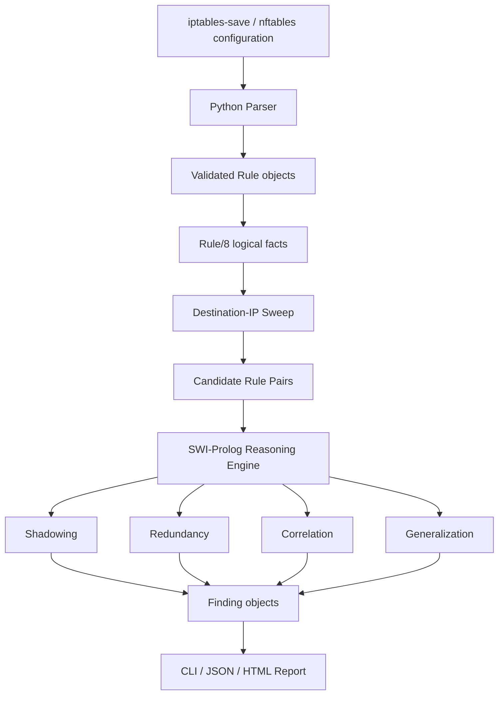

# FirewallLogic

## Automated Firewall Policy Auditing with Symbolic Reasoning and Scalable Candidate-Filtering

<p align="center">
  <strong>A research-oriented static analysis framework for detecting logical anomalies in firewall policies</strong>
</p>

<p align="center">
  
  
  
  
  
</p>

---

## Abstract

Firewall configurations are executable security policies rather than ordinary configuration files. Their correctness depends not only on the individual rules, but also on **rule ordering, overlap between traffic selectors, and the interaction between allow/deny decisions**. As policies grow, manually reviewing these interactions becomes difficult and error-prone.

**FirewallLogic** is a research-oriented static analysis framework that models firewall rules as logical predicates and uses **SWI-Prolog** to reason about policy relationships. The system focuses on four classes of policy anomalies—**Shadowing, Redundancy, Correlation, and Generalization**—while a Python layer handles configuration parsing, validation, orchestration, reporting, and web interaction.

A central engineering contribution is the introduction of a **destination-IP sweep-line candidate filter** before symbolic anomaly detection. Instead of forcing the logic engine to examine every possible pair of rules, the system first generates only pairs whose destination ranges can overlap. The implementation is therefore characterized more accurately as approximately **O(N log N + M)**, where `N` is the number of rules and `M` is the number of destination-overlapping candidate pairs, with an unavoidable **O(N²)** worst case when a configuration is highly dense.

The project is designed as a **research portfolio artifact** as well as a practical prototype: the repository separates parsing from reasoning, keeps the Prolog engine independently callable, includes regression-oriented test fixtures, supports both full and incremental analysis, and exposes an HTML interface for inspecting findings.

---

## Research Interests & Academic Alignment

This project also reflects a broader research direction centered on the intersection of:

- **Logic-Based AI** and symbolic reasoning
- **Explainable / Interpretable AI** and evidence-based decision systems
- **Neuro-Symbolic AI**, especially the combination of learned representations with explicit symbolic constraints
- **Formal Methods** and automated verification
- **Cybersecurity and intelligent policy analysis**
- **Algorithms, scalable inference, and static analysis**

FirewallLogic is primarily a **symbolic / logic-based system** rather than a machine-learning model. That distinction is intentional: the project explores how explicit rules and logical inference can provide deterministic, inspectable explanations for security decisions. This creates a natural foundation for future research in which symbolic verification is combined with learned components without sacrificing interpretability.

## Why This Project Matters as a Research Artifact

This project was intentionally built at the intersection of several areas rather than as a single-purpose firewall script:

| Research / Engineering Area | Role in FirewallLogic |
|---|---|
| **Cybersecurity** | Static auditing of security policies and access-control decisions |
| **Formal Methods** | Explicit logical predicates for containment, overlap, ordering, and contradiction |
| **Logic Programming** | SWI-Prolog inference engine for policy reasoning |
| **Algorithms & Complexity** | Sweep-line candidate generation to avoid unnecessary pairwise reasoning |
| **Programming Languages** | Separation between parser representation and logical rule representation |
| **Software Engineering** | Layered architecture, backend fallback, validation, regression tests, and incremental checks |
| **Explainable Analysis** | Findings include anomaly type, severity, rule IDs, explanation, and remediation guidance |

The main research idea is not simply to detect malformed syntax. It is to ask a deeper question:

> **Given a set of ordered firewall policies, can we automatically prove that certain rules are unreachable, useless, contradictory, or structurally fragile?**

That shift—from configuration parsing to **policy semantics**—is the core intellectual motivation of the project.

---

## Research Problem

For a rule set `R = {r₁, r₂, ..., rₙ}`, each rule is represented as a structured predicate over traffic dimensions:

```text
rule(ID, Priority, Action, Protocol, SrcIP, DstIP, SrcPort, DstPort)
```

Conceptually, a rule defines:

```text
Traffic Selector → Security Decision
```

where the traffic selector is the conjunction of protocol, source IP, destination IP, source port, and destination port constraints.

The difficulty is that firewall semantics are **relational**: the correctness of one rule can depend on the existence, position, and scope of another rule. Therefore, useful auditing requires reasoning over pairs of rules rather than inspecting rules independently.

---

## Research Questions

The current implementation can be framed around the following research questions:

1. **Semantic verification:** Can symbolic rules over network ranges and ports identify classical policy anomalies without executing live traffic?
2. **Scalability:** Can candidate-pair reduction significantly decrease the work required by pairwise anomaly detection on large policies?
3. **Separation of concerns:** Can parsing, logical inference, and presentation remain independently testable and replaceable?
4. **Operational usefulness:** Can the same reasoning engine support both full-policy auditing and pre-deployment checks for newly proposed rules?

These questions also define natural directions for future experimental evaluation.

---

## Main Contributions

### 1. Symbolic firewall policy model

Firewall rules are converted into explicit logical facts and analyzed as relationships between traffic regions. The engine reasons about:

- IP subnet containment and overlap
- Port equality, containment, and overlap
- Protocol compatibility
- Rule ordering via an explicit `Priority` field
- Allow/Deny action incompatibility
- Same-scope and covering relationships

### 2. Four anomaly detectors

The engine detects four policy-level anomalies:

| Anomaly | Meaning | Current Severity |
|---|---|---:|
| **Shadowing** | A later rule can never take effect because an earlier conflicting rule covers all of its traffic | **Critical** |
| **Correlation** | Partially overlapping rules have conflicting actions, making behavior dependent on ordering | **High** |
| **Generalization** | A specific rule precedes a broader conflicting rule; not necessarily incorrect, but potentially fragile | **Medium** |
| **Redundancy** | An earlier rule with the same action already covers the later rule | **Low** |

The severity levels are intentionally separated from the logical predicates so that the reasoning layer remains independent from presentation.

### 3. Sweep-line candidate filtering

The implementation avoids blindly sending the complete `N × N` rule cross-product to every detector. It first computes destination-IP intervals and performs a sweep-line pass to identify candidate pairs that may overlap.

The optimization is a **sound pre-filter**, not a replacement for the logical predicates: the original IP, port, protocol, containment, and action checks still run before a finding is emitted.

### 4. Shared candidate computation

All four anomaly detectors reuse a single candidate-pair set during the aggregated analysis. This removes the previous constant-factor waste of recomputing the same sweep for each anomaly category.

### 5. Dual Python/Prolog execution boundary

The `bridge.py` layer supports two execution paths:

- **PySwIP:** embedded SWI-Prolog for normal in-process execution
- **Subprocess fallback:** direct `swipl` invocation when the embedded backend is unavailable or fails

The reasoning engine therefore remains isolated from the Python presentation layer and can still be invoked independently.

### 6. Full and incremental analysis

Besides full auditing, the project provides a **check-new-rules** workflow:

```text
Trusted Base Configuration
          +
Proposed New Rules
          │
          ▼
     Merge + Renumber
          │
          ▼
 Same Existing Detector
          │
          ▼
 Findings involving ≥1 New Rule
```

This is useful as a pre-deployment policy check because already-reviewed old-vs-old findings are filtered out while new-rule interactions are still evaluated against the complete merged configuration.

### 7. Regression-oriented test fixtures

The repository includes isolated test configurations for individual anomaly classes as well as cases for:

- clean policies with no anomalies
- chain isolation
- IPv4/IPv6 isolation
- unsupported input lines
- incremental-analysis behavior
- priority-renumbering regression

This makes the logic easier to localize and verify than a single monolithic test case.

---

## System Architecture



### Architectural principle

A key design decision is that **the Python parser does not decide whether two rules are anomalous**. It only converts configuration syntax into validated semantic facts. The policy semantics stay inside the Prolog engine.

This separation provides three benefits:

1. The reasoning engine can be studied and tested independently.
2. New firewall syntaxes can be added without rewriting anomaly predicates.
3. The presentation layer can evolve without changing the policy semantics.

---

## Rule Representation

The central logical representation is:

```prolog
rule(
    ID,
    Priority,
    Action,
    Protocol,
    SrcIP,
    DstIP,
    SrcPort,
    DstPort
).
```

### Why `ID` and `Priority` are separate

This is an important design choice.

- `ID` identifies the rule for reporting and tracking.
- `Priority` represents **evaluation order**.

The detectors reason about `Priority`, not about numeric rule IDs. This prevents an important class of semantic errors in systems where identifiers and evaluation order are not guaranteed to be the same concept.

---

## Formal Semantics of the Detectors

### Shadowing

A later rule `r₂` is shadowed by an earlier rule `r₁` when:

```text
Priority(r₁) < Priority(r₂)
∧ Scope(r₂) ⊆ Scope(r₁)
∧ Action(r₁) ≠ Action(r₂)
```

Interpretation: every packet that could reach `r₂` is already captured by `r₁`, but `r₁` makes the opposite decision.

Example:

```text
Rule 1: ALLOW  192.168.1.0/24   → 10.0.0.5:80
Rule 2: DENY   192.168.1.10/32  → 10.0.0.5:80
```

Rule 2 can never fire.

### Redundancy

A later rule is redundant when an earlier rule covers its traffic and has the **same action**:

```text
Priority(r₁) < Priority(r₂)
∧ Scope(r₂) ⊆ Scope(r₁)
∧ Action(r₁) = Action(r₂)
```

The rule does not alter the policy decision, although it still adds configuration and processing overhead.

### Correlation

Two rules are correlated when their traffic regions overlap without one completely containing the other and their actions conflict.

This is a particularly important class because the observed decision can depend on rule ordering.

### Generalization

A more specific rule appears before a broader rule with a conflicting action. This is not necessarily a correctness bug, but it is a fragile configuration structure because future reordering can silently change policy behavior.

---

## Candidate-Generation Optimization

### Naive approach

A direct pairwise implementation examines:

```text
N(N-1)/2 = O(N²)
```

potential rule pairs.

That becomes expensive quickly as policy size increases.

### Sweep-line approach

The optimized engine first maps each destination IP range to an interval:

```text
Rule i → [start_i, end_i]
```

Then:

1. intervals are sorted by start position;
2. an active set contains intervals that may still overlap the current interval;
3. expired intervals are removed;
4. only active overlaps become candidate rule pairs;
5. the existing exact semantic predicates verify protocol, source IP, destination IP, ports, containment, ordering, and action.

### Complexity

Let:

- `N` = number of rules
- `M` = number of destination-overlapping candidate pairs

Then the practical structure is approximately:

```text
Sorting:          O(N log N)
Candidate pairs:  O(M)
Semantic checks:  O(M)
Overall:          O(N log N + M)
```

Because `M` can itself approach `N²` for very dense policies, the theoretical worst case remains:

```text
O(N²)
```

This is the correct asymptotic interpretation of the current implementation and is more precise than describing the optimization simply as `O(N log N)`.

### Why the pre-filter is safe

The sweep only eliminates pairs whose destination ranges cannot overlap. It does **not** assert that an overlap is an anomaly. Every surviving pair still goes through the original logical checks.

Therefore, the optimization changes **how many candidates are evaluated**, not **what counts as an anomaly**.

---

## Performance Evidence

The repository's Prolog source records a synthetic benchmark using clustered address zones:

| Configuration size | Earlier pairwise implementation | Optimized implementation |
|---:|---:|---:|
| 2,000 rules | ~13.8 s | ~0.45 s |
| 8,000 rules | estimated 3–4 min | ~6 s |

These figures should be interpreted as **implementation-reported synthetic benchmark results**, not as an independently reproduced benchmark in this repository snapshot. A future research version should publish the benchmark generator, hardware/software environment, repeated trials, confidence intervals, and scaling plots so that the performance claim becomes fully reproducible.

That distinction is important for scientific reporting: the optimization is implemented in the codebase, while the next step is to turn the current engineering benchmark into a formal experimental evaluation.

---

## Supported Input Formats

The parser automatically distinguishes between:

### iptables-save

Example:

```text
-A FORWARD -s 172.16.0.0/16 -d 10.0.0.5 -p tcp --dport 80 -j ACCEPT
```

### nftables

Example:

```text
ip filter FORWARD accept ip saddr 172.16.0.0/16 daddr 10.0.0.5 tcp dport 80
```

The internal rule model is intentionally syntax-independent. This makes vendor-specific parser modules a natural future extension.

---

## Validation and Defensive Programming

Several implementation details are deliberately defensive rather than relying on the firewall engine to fail later:

- CIDR/IP values are validated before being asserted into Prolog.
- IPv4 and IPv6 have explicit term representations.
- Port numbers and ranges are validated before semantic analysis.
- Unsupported lines are returned as structured `ParseError` objects rather than crashing the analysis.
- Empty or malformed configurations are handled explicitly.
- Engine failures are surfaced through the Python bridge rather than silently producing an empty report.
- The web interface limits uploaded files to 5 MB.

An especially important design property is that parser validation and Prolog validation mirror the same semantic constraints. This improves fault isolation at the language boundary.

---

## Chain Isolation and Dual-Stack Safety

### Chain isolation

Firewall rules are evaluated within a chain. Comparing rules from unrelated chains could create false positives, because they are not necessarily competing in the same decision path.

The Python bridge therefore partitions rules by chain and invokes the same proven detector separately for each chain.

### IPv4 / IPv6 isolation

The semantic predicates enforce address-family compatibility, so IPv4 and IPv6 rules cannot be reported as mutually shadowing or conflicting merely because their underlying integer representations overlap numerically.

The current destination sweep uses one numeric ordering for both families. This is **sound but not optimal for heavily dual-stack configurations**: some IPv4/IPv6 pairs may survive the pre-filter and then be rejected by the exact family check. Splitting the sweep by address family would reduce this extra work and is a reasonable future optimization.

---

## Software Architecture

```text
FirewallLogic/
│
├── parser.py                    # Parse iptables-save / nftables → Rule objects
├── ip_subnet.pl                 # IP/port semantic predicates
├── firewall_engine.pl           # Core symbolic anomaly reasoning
├── bridge.py                    # Python ↔ SWI-Prolog execution boundary
├── incremental.py               # Check proposed rules against existing policy
├── audit_log.py                 # Append-only audit metadata
├── main.py                      # CLI entry point
├── webapp.py                    # Flask web interface
│
├── templates/
│   ├── index.html               # Full audit UI
│   ├── report.html              # Full analysis report
│   ├── check_new.html           # Incremental-check UI
│   └── check_new_report.html    # Incremental report
│
├── static/
│   └── style.css                # Web UI styling
│
├── test_configs/
│   ├── 01_shadowing_only.rules
│   ├── 02_redundancy_only.rules
│   ├── 03_correlation_only.rules
│   ├── 04_generalization_only.rules
│   ├── 05_no_anomalies.rules
│   ├── 06_chain_isolation.rules
│   ├── 07_ipv4_ipv6_isolation.rules
│   └── 08_unsupported_lines.rules
│
├── demo_university_firewall.rules
├── run_tests.py
└── requirements.txt
```

---

## Reproducibility

### Requirements

- Python 3.8+
- SWI-Prolog 8.0+
- Flask 3.x
- PySwIP 0.3.2+

### Installation

```bash
# 1. Install SWI-Prolog separately
# Ubuntu/Debian
sudo apt install swi-prolog

# 2. Create the Python environment
python3 -m venv .venv
source .venv/bin/activate

# 3. Install Python dependencies
pip install -r requirements.txt
```

### Full audit

```bash
python3 main.py --demo

python3 main.py demo_university_firewall.rules --format text

python3 main.py demo_university_firewall.rules --format json
```

### Web interface

```bash
python3 webapp.py
```

Then open:

```text
http://127.0.0.1:5000/
```

### Regression tests

```bash
python3 run_tests.py
```

The test suite is intended to return exit code `0` when all expected behaviors pass, making it suitable for future CI integration.

---

## Test Strategy

The test suite is structured around **behavior isolation** rather than only end-to-end examples.

| Test | Purpose |
|---|---|
| `01_shadowing_only.rules` | Isolates shadowing |
| `02_redundancy_only.rules` | Isolates redundancy |
| `03_correlation_only.rules` | Isolates correlation |
| `04_generalization_only.rules` | Isolates generalization |
| `05_no_anomalies.rules` | Clean policy / negative test |
| `06_chain_isolation.rules` | Ensures unrelated chains do not interact |
| `07_ipv4_ipv6_isolation.rules` | Prevents cross-family false positives |
| `08_unsupported_lines.rules` | Validates graceful parser handling |

The demo configuration also acts as a regression fixture with an expected set of five findings.

> **Local verification note for this repository snapshot:** the source-level parser and test harness were inspectable, but a complete engine execution requires a local SWI-Prolog installation. The development environment used to prepare this README did not have `swipl` installed, so the full Prolog-backed test suite was not claimed as independently passed here.

---

## Web / Operational Features

The project includes a lightweight Flask interface on top of the research engine.

### Full audit

Upload a configuration and receive:

- rule count
- parse errors
- anomaly count
- severity distribution
- detailed findings
- recommendations

### Incremental audit

Upload:

1. the currently trusted firewall configuration, and
2. a second file containing only the proposed new rules.

The system merges them, renumbers the new rules safely, executes the existing detector, and reports only findings involving at least one newly proposed rule.

### Audit logging

Completed runs can be appended to `audit_log.csv` with metadata such as:

- timestamp
- source file(s)
- rule count
- finding counts by severity
- parser/analyzer completeness
- engine backend
- incremental/full mode

The log is intentionally fail-open so that a logging failure does not prevent a security analysis from completing.

### Optional authentication

Setting:

```text
FIREWALLLOGIC_PASSWORD
```

enables HTTP Basic Authentication. This is intentionally described as a lightweight local/development control rather than a production identity system.

For real deployment beyond localhost, HTTPS and a proper reverse-proxy/authentication layer would still be required.

---

## Example Finding

A finding is represented with structured fields rather than only prose:

```json
{
  "type": "shadowing",
  "severity": "critical",
  "primary_rule": 2,
  "secondary_rule": 1,
  "explanation": "The later rule is fully covered by an earlier conflicting rule."
}
```

This separation between **machine-readable finding data** and **human-readable explanations** makes the engine easier to integrate into future dashboards, CI checks, or automated remediation tools.

---

## Experimental Evidence & Performance Results

The performance figures below are **measured results documented in the implementation**, not hypothetical estimates. The benchmark was designed as a synthetic workload with clustered destination-address zones intended to approximate realistic overlap density in accumulated firewall configurations.

| Configuration | Original all-pairs engine | Optimized sweep-line engine | Improvement |
|---|---:|---:|---:|
| 2,000 rules | 13.8 s | 0.45 s | ~30× faster |
| 8,000 rules | estimated 3–4 min | ~6 s | substantial reduction |

The 2,000-rule result is a direct measured comparison between the pre-optimization implementation and the optimized implementation. The 8,000-rule comparison is reported as an observed optimized runtime against an extrapolated estimate for the original quadratic implementation, so the two figures should **not** be presented as equally controlled measurements.

The important algorithmic observation is that the optimization does not magically eliminate pairwise complexity. Its practical cost is better described as:

```text
O(N log N + M)
```

where `M` is the number of destination-IP-overlapping candidate pairs. In dense policies, `M` can approach `O(N²)`, so the theoretical worst case remains quadratic. The measured speedup comes from reducing the number of pairs that reach the more expensive symbolic checks in realistic sparse/moderately-overlapping configurations.

### Reproducibility of the benchmark

The benchmark claims are documented directly in `firewall_engine.pl`, alongside the optimization rationale and complexity discussion. For a stronger academic evaluation, future versions should expose a standalone benchmark script that generates identical workloads and records: rule count, candidate-pair count, runtime, memory, backend, and hardware/software environment.

## Screenshots / Experimental Outputs

This section is intentionally prepared as a place to document the **actual observed outputs of the program**. For a research-oriented GitHub repository, screenshots should show the system working rather than only the interface design.

### 1. Web Interface

Place the screenshot at:

```text
images/web-interface.png
```

```markdown

```

### 2. Full Analysis Report

Place the screenshot at:

```text
images/full-report.png
```

```markdown

```

### 3. Detected Anomalies

Place the screenshot at:

```text
images/anomaly-findings.png
```

```markdown

```

### 4. Incremental / New-Rule Check

Place the screenshot at:

```text
images/incremental-check.png
```

```markdown

```

### 5. CLI / JSON Output

Place the screenshot at:

```text
images/cli-output.png
```

```markdown

```

### 6. Performance / Benchmark Result

Place the screenshot at:

```text
images/benchmark.png
```

```markdown

```

### Recommended research presentation

For a professor reviewing this repository, the most informative screenshots are:

1. a configuration being uploaded;
2. the anomaly report with severity distribution;
3. a concrete shadowing/correlation example with the involved rule IDs;
4. the incremental check showing a newly introduced anomaly;
5. optionally, a benchmark plot showing analysis time versus rule count.

---

## Suggested Experimental Evaluation

A natural next step for turning this portfolio project into a stronger research artifact is to formalize the evaluation protocol.

### Dataset dimensions

Evaluate across:

- rule-set size: 100 / 500 / 1K / 2K / 4K / 8K / 16K
- overlap density: sparse / moderate / dense
- address family: IPv4 / IPv6 / dual-stack
- chain count: single / multiple
- anomaly ratio: low / medium / high

### Baselines

Compare:

1. naive all-pairs symbolic analysis;
2. current DstIP sweep candidate filter;
3. future multi-dimensional filtering;
4. optionally, alternative indexing structures.

### Metrics

Measure:

- end-to-end runtime;
- candidate-pair count;
- speedup versus naive baseline;
- memory usage;
- number of true findings;
- false-positive rate, if a labeled benchmark is available;
- parser failure rate;
- backend overhead (PySwIP vs subprocess).

This would turn the current optimization from an implementation claim into a reproducible algorithmic experiment.

---

## Limitations

The current system is a **research prototype**, not a production firewall management platform. Important limitations include:

- vendor-specific syntax coverage is limited to the implemented iptables-save and nftables parser paths;
- anomaly semantics currently focus on four classical categories;
- the sweep optimization can still degrade to O(N²) for highly overlapping policies;
- mixed IPv4/IPv6 sweeps are sound but can generate extra cross-family candidates before semantic rejection;
- the Python parser and Prolog validator intentionally duplicate some validation logic, which creates a maintenance synchronization point;
- the subprocess backend has different timeout characteristics from in-process PySwIP execution;
- the web authentication layer is intentionally minimal and should not be treated as enterprise IAM;
- the current audit log is a local append-only CSV and is not designed as a distributed logging system.

Documenting these limitations is deliberate: a strong research artifact should clearly distinguish **implemented capabilities**, **known trade-offs**, and **future hypotheses**.

---

## Future Research Directions

The current architecture leaves several research extensions open.

### 1. Multi-dimensional spatial indexing

Extend candidate generation beyond destination IP to source IP, ports, and protocol classes, while preserving the soundness argument of the current pre-filter.

### 2. Vendor-neutral intermediate representation

Introduce a canonical policy IR that supports vendor-specific parsers for platforms such as:

- Cisco ASA
- Fortinet FortiGate
- Palo Alto Networks
- nftables / iptables variants

### 3. Explainable policy reasoning

Generate natural-language proof traces explaining *why* a rule is shadowed, redundant, or correlated, including the exact containment/overlap relationships used in the proof.

### 4. CI/CD policy verification

Expose the analyzer as a command-line gate for infrastructure repositories:

```text
Pull Request → Firewall Policy Diff → FirewallLogic → Fail / Pass + Findings
```

### 5. Machine-learning risk prioritization

A future layer could learn from historical policy changes to rank findings by operational risk. The symbolic engine should remain the source of the correctness constraints, while ML acts as a prioritization or recommendation layer.

### 6. Neuro-symbolic extension

A longer-term research direction is to combine symbolic policy constraints with learned representations of network behavior, enabling a system that can distinguish:

```text
Logically possible
        vs.
Operationally likely
```

without weakening the deterministic policy-verification core.

---

## Research Positioning

A useful way to interpret FirewallLogic is as a **symbolic security-analysis pipeline**:

```text
Raw Configuration
      ↓
Semantic Parsing
      ↓
Formal Rule Representation
      ↓
Candidate Reduction
      ↓
Symbolic Inference
      ↓
Structured Evidence
      ↓
Human / Machine Decision
```

This makes the project relevant not only to firewall administration, but also to broader research themes such as:

- formal verification of access-control policies;
- symbolic AI and logic programming;
- scalable static program analysis;
- explainable security tooling;
- rule-based decision systems;
- neuro-symbolic system design.

---

## What a Research Supervisor Can Evaluate from This Repository

A reviewer can inspect the repository at several levels:

### Algorithmic thinking

The code identifies a quadratic bottleneck, introduces a candidate-generation strategy, states the actual worst-case behavior, and preserves exact semantic checks after optimization.

### Formal reasoning

The central anomalies are expressed as logical relations—containment, overlap, ordering, equality, and action conflict—rather than heuristic text matching.

### Systems thinking

The project is decomposed into parser, semantic engine, language bridge, incremental analysis, reporting, and web layers.

### Research maturity

The repository distinguishes implemented features from planned work, records limitations, keeps isolated regression fixtures, and leaves a path toward reproducible benchmarking.

### Engineering discipline

The bridge handles backend failures explicitly, validation is performed before facts cross the language boundary, chain separation is enforced, and the project includes an executable regression suite.

---

## Author

**Moein Hassanpour**  
Computer Science Student  

Research interests:

- Neuro-Symbolic AI
- Formal Methods
- Cybersecurity
- Symbolic Reasoning
- Intelligent Systems
- Scalable Static Analysis

---

## License

This project is released under the **MIT License**.

---

## Citation / Reference

This repository is currently presented as a research portfolio and implementation artifact rather than as a published paper. For academic use, cite the repository and the specific commit/version used in an experiment.

A future publication should add a formal citation entry here once the project has an associated paper, technical report, or DOI.
